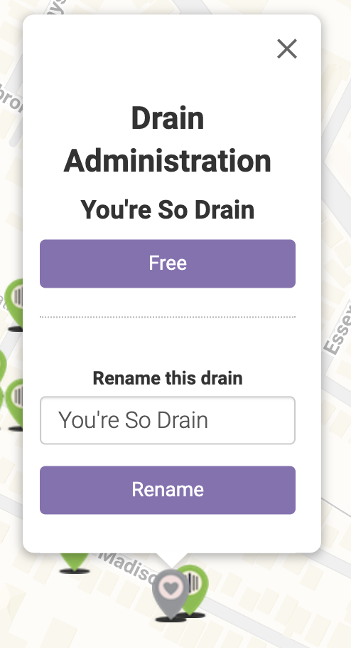
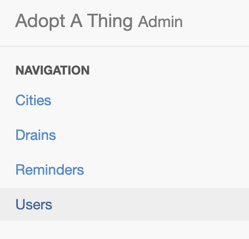
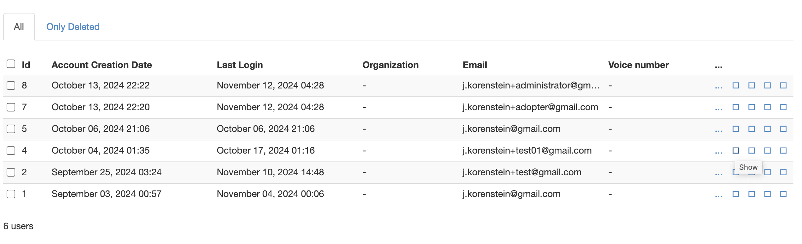
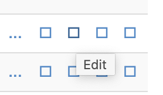
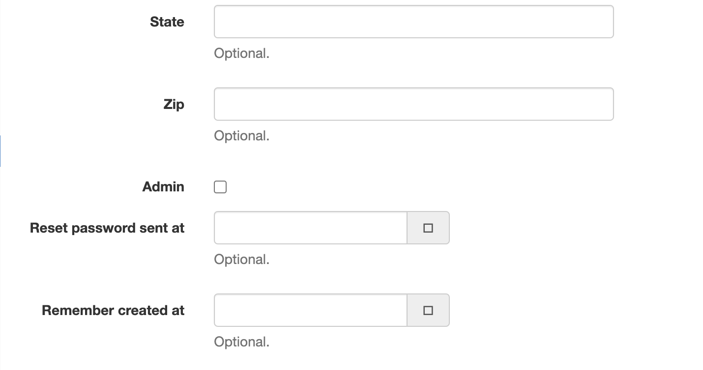
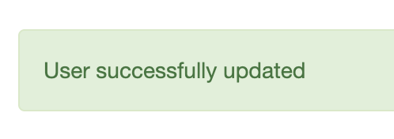

# Municipal Administrator Guide

## Renaming and Freeing Drains

- If you are an administrator, when you click on a drain, you will have the option to Free or Rename that drain

## Adding or Removing Administrators

- An administrator can promote any user to be an administrator

How to promote a user to administrator:

- If you are an administrator, you have access to a special page which is your URL followed by `/admin` for example:
  `https://somerville.mysticdrains.org/admin`
  - Under Navigation choose Users to get a list of Users
    
  - On the right side of any user, click the second box to edit the user
    
    
  - Scroll down until you get to the Admin checkbox. Make a user an Administrator by checking the box.
    
  - Uncheck the box to remove Administrator privilege
  - Hit Save and you should get a success notification.
    
